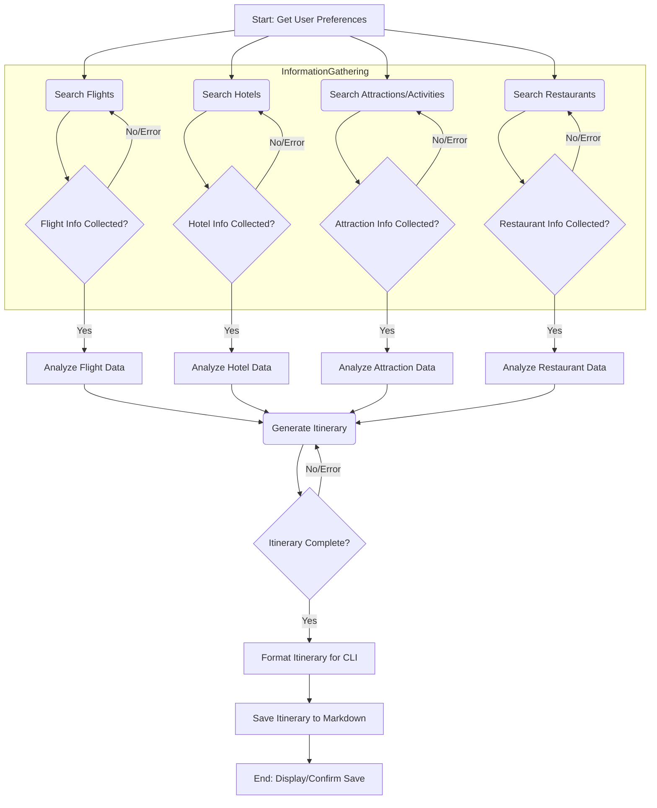
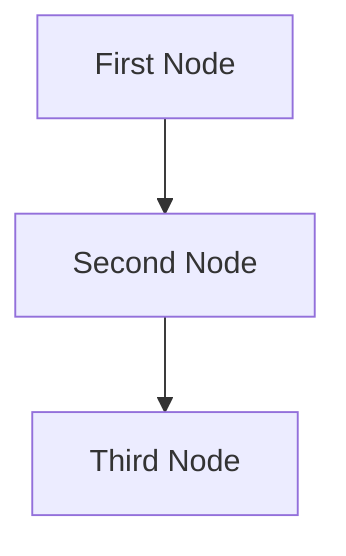

# Design Doc: AI-Powered Pocket Trip Planner

## 1. Requirements

This project aims to create an AI-powered travel planner CLI application using PocketFlow. The application will assist users in planning their trips by gathering their preferences, searching for relevant travel information online, and generating a comprehensive, day-by-day itinerary.

**User Perspective:**

Users want a simple way to plan trips without manually browsing numerous websites for flights, hotels, and attractions. They need a consolidated itinerary with actionable links and recommendations tailored to their preferences (target city/cities, date range, budget, interests).

**Core Features:**

1.  **User Input Collection:**
    -   Prompt users for target city or cities.
    -   Prompt users for travel date range.
    -   Prompt users for other requirements (e.g., budget, interests like historical sites, nature, nightlife, food preferences).
2.  **Information Gathering (Web Search):**
    -   Search for flight tickets.
    -   Search for hotel accommodations.
    -   Search for places to visit (attractions, restaurants, local experiences).
    -   Utilize web search tools (e.g., DuckDuckGo, Brave via `web_search` tool) or MCP servers like Puppeteer for more complex scraping if needed.
3.  **Analysis and Recommendation:**
    -   **Flights:** Recommend best options based on cost-effectiveness (price, layovers) and convenience (duration, departure/arrival times).
    -   **Hotels:** Recommend options based on location (proximity to attractions, safety), budget, amenities, and user ratings/reviews.
    -   **Attractions/Activities:** Suggest must-visit attractions and activities based on user interests and popularity.
    -   **Restaurants:** Recommend dining options catering to different cuisines and budgets, based on user preferences and reviews.
4.  **Itinerary Generation:**
    -   Produce a day-by-day itinerary.
    -   Include must-visit attractions with brief descriptions.
    -   Include restaurant recommendations for different meals.
    -   Include local transportation options (e.g., public transport, ride-sharing services).
    -   Provide direct website links for each item (flights, hotels, attractions, restaurants) for users to access more details or make bookings.
5.  **Output:**
    -   Display the itinerary in the CLI.
    -   Save the itinerary as a markdown file.

**Technical Considerations:**

-   **Framework:** PocketFlow
-   **Interface:** Command-Line Interface (CLI) initially.
-   **Data Persistence:** Itinerary saved as a markdown file.

**AI System Fit:**

-   **Good for:**
    -   Routine tasks: Gathering user input, structuring queries for web search.
    -   Creative tasks with well-defined inputs: Analyzing search results, summarizing information, generating a structured itinerary.
-   **Limitations to consider:**
    -   Real-time data accuracy: Flight prices and hotel availability change rapidly. The system should provide links for users to verify and book.
    -   Subjectivity of "best": Recommendations will be based on defined criteria and LLM reasoning, but user preferences can be nuanced.

**Complexity vs. Impact:**

-   **High Value / Low-Medium Complexity (Initial Focus):**
    -   CLI for input/output.
    -   Basic web search for flights, hotels, attractions (using general search queries).
    -   LLM for summarizing information and generating a basic itinerary structure.
    -   Saving itinerary to a markdown file.
-   **Higher Complexity (Future Enhancements):**
    -   Direct API integrations with flight/hotel providers (if available and feasible).
    -   More sophisticated web scraping using tools like Puppeteer for sites without good APIs.
    -   Personalized recommendations based on past user trips or more detailed preference models.
    -   Interactive itinerary refinement.

## 2. Flow Design

The AI-powered Travel Planner will orchestrate several nodes to achieve its goal. The overall flow can be visualized as follows:



**Node Descriptions (High-Level):**

1.  **`GetUserPreferencesNode`**:
    -   Prompts the user for travel details (city, dates, budget, interests).
    -   Stores these preferences in the shared store.
2.  **`SearchFlightsNode`**:
    -   Reads preferences from the shared store.
    -   Constructs search queries for flights.
    -   Uses a web search utility (e.g., `web_search` tool or Puppeteer via MCP) to find flight information.
    -   Stores raw flight data (links, prices, times) in the shared store.
3.  **`SearchHotelsNode`**:
    -   Reads preferences from the shared store.
    -   Constructs search queries for hotels.
    -   Uses a web search utility to find hotel information.
    -   Stores raw hotel data (links, prices, locations, amenities) in the shared store.
4.  **`SearchAttractionsNode`**:
    -   Reads preferences (city, interests) from the shared store.
    -   Constructs search queries for attractions and activities.
    -   Uses a web search utility to find information.
    -   Stores raw attraction data (links, descriptions, locations) in the shared store.
5.  **`SearchRestaurantsNode`**:
    -   Reads preferences (city, food preferences, budget) from the shared store.
    -   Constructs search queries for restaurants.
    -   Uses a web search utility to find information.
    -   Stores raw restaurant data (links, cuisine types, price ranges, locations) in the shared store.
6.  **`AnalyzeFlightDataNode`**:
    -   Reads raw flight data from the shared store.
    -   Uses an LLM utility to analyze and select the best flight options based on cost-effectiveness and convenience.
    -   Stores processed flight recommendations in the shared store.
7.  **`AnalyzeHotelDataNode`**:
    -   Reads raw hotel data from the shared store.
    -   Uses an LLM utility to analyze and select the best hotel options based on location, budget, amenities, and ratings.
    -   Stores processed hotel recommendations in the shared store.
8.  **`AnalyzeAttractionDataNode`**:
    -   Reads raw attraction data from the shared store.
    -   Uses an LLM utility to filter and select relevant attractions based on user interests.
    -   Stores processed attraction recommendations in the shared store.
9.  **`AnalyzeRestaurantDataNode`**:
    -   Reads raw restaurant data from the shared store.
    -   Uses an LLM utility to filter and select relevant restaurants based on user preferences.
    -   Stores processed restaurant recommendations in the shared store.
10. **`GenerateItineraryNode`**:
    -   Reads all processed recommendations (flights, hotels, attractions, restaurants) and user preferences from the shared store.
    -   Uses an LLM utility to synthesize this information into a coherent, day-by-day itinerary.
    -   Ensures links are included for each item.
    -   Stores the generated itinerary text in the shared store.
11. **`FormatItineraryCLINode`**:
    -   Reads the generated itinerary from the shared store.
    -   Formats it for clear display in the command line.
    -   Stores the CLI-formatted itinerary in the shared store.
12. **`SaveItineraryMarkdownNode`**:
    -   Reads the generated itinerary (raw or CLI formatted) from the shared store.
    -   Formats it as a markdown document.
    -   Saves the markdown content to a file (e.g., `trip_plan.md`).
    -   Stores the file path/status in the shared store.
13. **`DisplayEndNode`**:
    -   Displays the CLI-formatted itinerary.
    -   Confirms to the user that the itinerary has been saved to a file and provides the file path.

## 3. Utilities

Based on the Flow Design, the following utility functions will be necessary. Each will reside in its own file within the `utils/` directory and include a `if __name__ == "__main__":` block for individual testing.

1.  **`call_llm(prompt: str) -> str`**

    -   **File**: `utils/call_llm.py` (already partially present in example, will be adapted)
    -   **Input**: A string prompt for the Large Language Model.
    -   **Output**: The LLM's text response as a string.
    -   **Necessity**: Core for analyzing search results, generating summaries, and creating the itinerary. It will be used by `AnalyzeFlightDataNode`, `AnalyzeHotelDataNode`, `AnalyzeAttractionDataNode`, `AnalyzeRestaurantDataNode`, and `GenerateItineraryNode`.
    -   **Implementation Note**: Will use the OpenAI API (or a similar LLM provider). Requires API key management (e.g., environment variable).

2.  **`search_web_duckduckgo(query: str, num_results: int = 5) -> list[dict]`**

    -   **File**: `utils/search_web_duckduckgo.py`
    -   **Input**: A search query string and an optional number of results to return.
    -   **Output**: A list of dictionaries, where each dictionary contains `title`, `link`, and `snippet` for a search result.
    -   **Necessity**: To gather information on flights, hotels, attractions, and restaurants. Used by `SearchFlightsNode`, `SearchHotelsNode`, `SearchAttractionsNode`, and `SearchRestaurantsNode`.
    -   **Implementation Note**: Can use a library like `duckduckgo_search` or make direct HTTP requests.

3.  **`search_web_brave(query: str, num_results: int = 5) -> list[dict]`** (Alternative/Additional to DuckDuckGo)

    -   **File**: `utils/search_web_brave.py`
    -   **Input**: A search query string and an optional number of results to return.
    -   **Output**: A list of dictionaries, similar to `search_web_duckduckgo`.
    -   **Necessity**: Provides an alternative search engine if DuckDuckGo results are insufficient or if Brave Search offers better quality for certain queries. Usage similar to `search_web_duckduckgo`.
    -   **Implementation Note**: Will require interacting with the Brave Search API (if available) or using a suitable library.

4.  **`run_puppeteer_script(script_name: str, url: str, task_details: dict) -> str`** (Optional, for complex scraping)

    -   **File**: `utils/run_puppeteer.py` (This would be a wrapper to call an MCP server)
    -   **Input**: Name of a specific Puppeteer script (if we pre-define scripts for certain sites), the target URL, and a dictionary of task-specific details (e.g., what to extract).
    -   **Output**: Extracted data as a string (e.g., JSON string, or structured text).
    -   **Necessity**: For websites where simple web search is insufficient and direct scraping is needed (e.g., sites heavily reliant on JavaScript or requiring interaction). Could be used by the search nodes as a fallback or primary method for specific data sources.
    -   **Implementation Note**: This utility would interface with the `mcp.config.usrlocalmcp.Puppeteer` MCP server. It would involve constructing the correct `args` for the `puppeteer_navigate`, `puppeteer_evaluate`, `puppeteer_click`, etc., tools provided by the MCP server.

5.  **`save_markdown(content: str, filename: str) -> bool`**
    -   **File**: `utils/save_markdown.py`
    -   **Input**: The markdown content string and the desired filename (e.g., "trip_itinerary.md").
    -   **Output**: Boolean indicating success or failure of the save operation.
    -   **Necessity**: To save the final generated itinerary to a file. Used by `SaveItineraryMarkdownNode`.
    -   **Implementation Note**: Standard file I/O operations in Python.

## 4. Node Design

**Shared Store Design:**

The shared store will be an in-memory Python dictionary. It will hold user preferences, raw data fetched from the web, processed recommendations, and the final itinerary.

```python
shared = {
    "user_preferences": {
        "target_cities": ["Paris", "Rome"], # List of strings
        "date_range": {"start": "2024-08-01", "end": "2024-08-10"},
        "budget": "mid-range", # e.g., 'budget', 'mid-range', 'luxury'
        "interests": ["history", "food", "art"], # List of strings
        "other_requirements": "Prefer direct flights if possible."
    },
    "raw_data": {
        "flights": [
            {"source": "kayak.com/flights/...". "price": "€300", "duration": "3h", "stops": 0, "airline": "Air France"},
            # ... more flight results
        ],
        "hotels": [
            {"name": "Hotel ABC", "price_per_night": "€150", "rating": "4.5/5", "location": "Central", "amenities": ["wifi", "breakfast"], "link": "booking.com/hotel_abc/..."},
            # ... more hotel results
        ],
        "attractions": [
            {"name": "Eiffel Tower", "description": "Iconic landmark...", "type": "sightseeing", "link": "toureiffel.paris/en/..."},
            # ... more attraction results
        ],
        "restaurants": [
            {"name": "Le Petit Bistro", "cuisine": "French", "price_range": "€€", "rating": "4.7/5", "link": "example.com/le_petit_bistro/..."},
            # ... more restaurant results
        ]
    },
    "processed_recommendations": {
        "flights": [
            {"details": "Air France, €300, 3h direct", "link": "kayak.com/flights/..."},
            # ... selected flight options
        ],
        "hotels": [
            {"name": "Hotel ABC", "details": "€150/night, Central, 4.5/5", "link": "booking.com/hotel_abc/..."},
            # ... selected hotel options
        ],
        "daily_plans": {
            # "YYYY-MM-DD": {
            # "city": "Paris",
            # "morning_activity": {"name": "Louvre Museum", "description": "...", "link": "..."},
            # "lunch": {"name": "Restaurant X", "description": "...", "link": "..."},
            # "afternoon_activity": {"name": "Seine River Cruise", "description": "...", "link": "..."},
            # "dinner": {"name": "Restaurant Y", "description": "...", "link": "..."},
            # "transport_notes": "Use Metro line 1."
            # }
        }
    },
    "final_itinerary_text": "Day 1: Paris\nMorning: Louvre Museum (...)\n...",
    "cli_formatted_itinerary": "---- Day 1: Paris ----\n...",
    "saved_itinerary_filepath": "/path/to/trip_plan.md"
}
```

**Node Details:**

For each node, we'll specify its type, how it prepares data (`prep`), what it executes (`exec`), and how it updates the shared store (`post`). All nodes will be `Regular` type unless specified.

1.  **`GetUserPreferencesNode`**

    -   `type`: Regular
    -   `prep`: None (or reads initial empty `shared["user_preferences"]` if pre-filled for testing).
    -   `exec`: Interactively prompts the user for `target_cities`, `date_range`, `budget`, `interests`, `other_requirements`.
    -   `post`: Writes the collected information into `shared["user_preferences"]`.

2.  **`SearchFlightsNode`**

    -   `type`: Regular
    -   `prep`: Reads `shared["user_preferences"]` (target cities, date range).
    -   `exec`: Calls `utils.search_web_duckduckgo` (or Brave, or Puppeteer) with queries like "flights from [origin_city_assumption or ask] to [target_city] from [start_date] to [end_date]". May need to iterate if multiple cities.
    -   `post`: Appends search results (list of dicts with link, price, etc.) to `shared["raw_data"]["flights"]`.

3.  **`SearchHotelsNode`**

    -   `type`: Regular
    -   `prep`: Reads `shared["user_preferences"]` (target cities, date range, budget).
    -   `exec`: Calls `utils.search_web_duckduckgo` with queries like "hotels in [target_city] for [date_range] [budget_preference]".
    -   `post`: Appends search results to `shared["raw_data"]["hotels"]`.

4.  **`SearchAttractionsNode`**

    -   `type`: Regular
    -   `prep`: Reads `shared["user_preferences"]` (target cities, interests).
    -   `exec`: Calls `utils.search_web_duckduckgo` with queries like "top attractions in [target_city] for [interest]" or "things to do in [target_city]".
    -   `post`: Appends search results to `shared["raw_data"]["attractions"]`.

5.  **`SearchRestaurantsNode`**

    -   `type`: Regular
    -   `prep`: Reads `shared["user_preferences"]` (target cities, interests like 'food', budget).
    -   `exec`: Calls `utils.search_web_duckduckgo` with queries like "best [cuisine_type] restaurants in [target_city] [budget_preference]".
    -   `post`: Appends search results to `shared["raw_data"]["restaurants"]`.

6.  **`AnalyzeFlightDataNode`**

    -   `type`: Regular
    -   `prep`: Reads `shared["raw_data"]["flights"]` and `shared["user_preferences"]` (for context like 'prefer direct').
    -   `exec`: Calls `utils.call_llm` with a prompt to analyze the raw flight data and select 1-3 best options based on cost, convenience, and user preferences. Prompt should ask for structured output if possible, or the node will parse the LLM text.
    -   `post`: Writes the selected flight recommendations to `shared["processed_recommendations"]["flights"]`.

7.  **`AnalyzeHotelDataNode`**

    -   `type`: Regular
    -   `prep`: Reads `shared["raw_data"]["hotels"]` and `shared["user_preferences"]`.
    -   `exec`: Calls `utils.call_llm` to analyze raw hotel data and select 1-3 best options based on location, budget, amenities, ratings, and user preferences.
    -   `post`: Writes selected hotel recommendations to `shared["processed_recommendations"]["hotels"]`.

8.  **`AnalyzeAttractionDataNode`**

    -   `type`: Regular
    -   `prep`: Reads `shared["raw_data"]["attractions"]` and `shared["user_preferences"]["interests"]`.
    -   `exec`: Calls `utils.call_llm` to analyze raw attraction data, filter by interests, and select a list of recommended attractions with brief descriptions and links.
    -   `post`: Writes recommendations to `shared["processed_recommendations"]["attractions_for_itinerary"]` (a new key, or integrated into `daily_plans` structure later).

9.  **`AnalyzeRestaurantDataNode`**

    -   `type`: Regular
    -   `prep`: Reads `shared["raw_data"]["restaurants"]` and `shared["user_preferences"]`.
    -   `exec`: Calls `utils.call_llm` to analyze raw restaurant data, filter by preferences, and select a list of recommended restaurants with brief descriptions and links.
    -   `post`: Writes recommendations to `shared["processed_recommendations"]["restaurants_for_itinerary"]`.

10. **`GenerateItineraryNode`**

    -   `type`: Regular
    -   `prep`: Reads `shared["user_preferences"]` (especially `date_range` and `target_cities`), `shared["processed_recommendations"]["flights"]`, `shared["processed_recommendations"]["hotels"]`, and the processed attraction/restaurant lists.
    -   `exec`: Calls `utils.call_llm` with a comprehensive prompt to construct a day-by-day itinerary. The prompt will instruct the LLM to allocate attractions and restaurant suggestions across the travel dates, considering travel between cities if applicable. It should include transportation notes and ensure all items have links.
    -   `post`: Writes the structured daily plan to `shared["processed_recommendations"]["daily_plans"]` and a combined text version to `shared["final_itinerary_text"]`.

11. **`FormatItineraryCLINode`**

    -   `type`: Regular
    -   `prep`: Reads `shared["final_itinerary_text"]` or `shared["processed_recommendations"]["daily_plans"]`.
    -   `exec`: Formats the itinerary string for readable CLI output (e.g., using newlines, simple headers).
    -   `post`: Writes the formatted string to `shared["cli_formatted_itinerary"]`.

12. **`SaveItineraryMarkdownNode`**

    -   `type`: Regular
    -   `prep`: Reads `shared["final_itinerary_text"]` or `shared["processed_recommendations"]["daily_plans"]`.
    -   `exec`: Converts the itinerary into markdown format (e.g., using headings for days, bullet points for activities/restaurants, and markdown links). Calls `utils.save_markdown` to save it to a file (e.g., `[city_name]_trip_plan.md`).
    -   `post`: Writes the output filepath to `shared["saved_itinerary_filepath"]`.

13. **`DisplayEndNode`**
    -   `type`: Regular
    -   `prep`: Reads `shared["cli_formatted_itinerary"]` and `shared["saved_itinerary_filepath"]`.
    -   `exec`: Prints the CLI formatted itinerary to the console. Prints a confirmation message with the saved file path.
    -   `post`: None (or sets a flag like `shared["status"] = "completed"`).

## 5. PocketFlow Graph Definition

This section defines the sequence and dependencies of the nodes within the PocketFlow graph. We'll represent this as a list of edges, where each edge is `(source_node_name, destination_node_name)`.

```python
# pocket_trip_graph.py (Illustrative)
from pocketflow import Graph

# Assume node classes are defined elsewhere (e.g., GetUserPreferencesNode, SearchFlightsNode, etc.)

def create_travel_planner_graph():
    graph = Graph(name="AI_Travel_Planner")

    # Define nodes (instances of Node classes)
    get_user_prefs = GetUserPreferencesNode(name="GetUserPreferences")
    search_flights = SearchFlightsNode(name="SearchFlights")
    search_hotels = SearchHotelsNode(name="SearchHotels")
    search_attractions = SearchAttractionsNode(name="SearchAttractions")
    search_restaurants = SearchRestaurantsNode(name="SearchRestaurants")
    analyze_flights = AnalyzeFlightDataNode(name="AnalyzeFlightData")
    analyze_hotels = AnalyzeHotelDataNode(name="AnalyzeHotelData")
    analyze_attractions = AnalyzeAttractionDataNode(name="AnalyzeAttractionData")
    analyze_restaurants = AnalyzeRestaurantDataNode(name="AnalyzeRestaurantData")
    generate_itinerary = GenerateItineraryNode(name="GenerateItinerary")
    format_cli = FormatItineraryCLINode(name="FormatItineraryCLI")
    save_markdown = SaveItineraryMarkdownNode(name="SaveItineraryMarkdown")
    display_end = DisplayEndNode(name="DisplayEnd")

    # Add nodes to the graph
    graph.add_nodes([
        get_user_prefs, search_flights, search_hotels, search_attractions, search_restaurants,
        analyze_flights, analyze_hotels, analyze_attractions, analyze_restaurants,
        generate_itinerary, format_cli, save_markdown, display_end
    ])

    # Define edges (dependencies)
    graph.add_edges([
        (get_user_prefs, search_flights),
        (get_user_prefs, search_hotels),
        (get_user_prefs, search_attractions),
        (get_user_prefs, search_restaurants),

        (search_flights, analyze_flights),
        (search_hotels, analyze_hotels),
        (search_attractions, analyze_attractions),
        (search_restaurants, analyze_restaurants),

        # GenerateItinerary depends on all analysis nodes and user preferences
        (analyze_flights, generate_itinerary),
        (analyze_hotels, generate_itinerary),
        (analyze_attractions, generate_itinerary),
        (analyze_restaurants, generate_itinerary),
        (get_user_prefs, generate_itinerary), # To ensure date_range etc. are available

        (generate_itinerary, format_cli),
        (generate_itinerary, save_markdown),

        (format_cli, display_end),
        (save_markdown, display_end) # Display can happen after saving is confirmed
    ])

    # Set the entry and exit points for the graph
    graph.set_entry_node(get_user_prefs)
    # PocketFlow might infer exit nodes, or we can explicitly define them if needed.
    # For this linear flow with a clear end, DisplayEnd is the natural exit.

    return graph

if __name__ == "__main__":
    travel_planner = create_travel_planner_graph()
    # To run:
    # initial_shared_store = {}
    # final_store = travel_planner.run(initial_shared_store)
    # print("Travel planning complete. Final store:", final_store)
    print("Travel planner graph created. Run with PocketFlow executor.")

```

**Explanation:**

-   The graph starts with `GetUserPreferencesNode`.
-   Once user preferences are gathered, the four search nodes (`SearchFlightsNode`, `SearchHotelsNode`, `SearchAttractionsNode`, `SearchRestaurantsNode`) can potentially run in parallel if the PocketFlow executor supports it, as they only depend on user preferences.
-   Each search node is followed by its corresponding analysis node (e.g., `SearchFlightsNode` -> `AnalyzeFlightDataNode`).
-   `GenerateItineraryNode` depends on the outputs of all four analysis nodes and the initial user preferences (for dates, cities, etc.).
-   After the itinerary is generated, `FormatItineraryCLINode` and `SaveItineraryMarkdownNode` can process it.
-   Finally, `DisplayEndNode` shows the CLI output and confirms the save location. It depends on both formatting and saving being complete.

This structure allows for a clear data flow and potential parallelization of independent tasks.

## 6. Error Handling and Resilience

Each node in the PocketFlow graph should implement basic error handling.

-   **Web Search Nodes (`SearchFlightsNode`, `SearchHotelsNode`, etc.):**
    -   Handle network errors (timeouts, connection issues) by retrying a few times with exponential backoff.
    -   If web scraping fails (e.g., website structure changed), log the error and attempt to proceed with partial data or skip the problematic source.
    -   If no results are found, this should be treated as a valid empty result, not an error, and propagated to the analysis nodes.
-   **LLM Call Utility (`utils.call_llm`):**
    -   Handle API errors from the LLM provider (e.g., rate limits, server errors) with retries.
    -   If the LLM output is unparsable or doesn't meet expected format, try a modified prompt or a fallback parsing strategy. If still failing, log and potentially ask the user for clarification or manual input for that step.
-   **Analysis Nodes (`AnalyzeFlightDataNode`, etc.):**
    -   If input data from search nodes is missing or insufficient, the node should gracefully handle this, possibly by indicating that no recommendations can be made for that category.
-   **File I/O (`SaveItineraryMarkdownNode`):**
    -   Handle `IOError` if the file cannot be written (e.g., permissions, disk full). Inform the user and perhaps offer to display the itinerary in the console only.
-   **General Node Execution:**
    -   PocketFlow itself might offer mechanisms for node-level error catching and retry policies. These should be leveraged.
    -   A global error state could be maintained in the `shared` store, e.g., `shared["errors"] = []`, where nodes can append error messages.
    -   The `DisplayEndNode` can check this list and inform the user of any non-critical errors that occurred during the process.

## 7. Future Enhancements

-   **GUI Interface:** Develop a web-based or desktop GUI for a more user-friendly experience instead of a CLI.
-   **User Accounts & History:** Allow users to save preferences and past itineraries.
-   **Real-time Updates:** For long trips, allow re-checking flight/hotel prices closer to the date.
-   **Booking Integration:** Directly link to booking platforms or even integrate booking APIs (requires significant security and partnership considerations).
-   **Advanced Preference Options:** More granular control over flight (e.g., specific airlines, layover preferences) and hotel choices (e.g., specific chains, accessibility features).
-   **Collaborative Planning:** Allow multiple users to contribute to an itinerary.
-   **Offline Maps & Info:** Option to download relevant map sections and attraction information for offline use.
-   **Budget Tracking:** Help users track expenses against their set budget.
-   **Alternative Transport:** Include options for train or bus travel between cities.
-   **Visa & Travel Advisory Info:** Integrate checks for visa requirements and travel advisories for the destination.
-   **Multi-Language Support:** Offer the interface and itinerary in multiple languages.

> Please DON'T remove notes for AI

## Requirements

> Notes for AI: Keep it simple and clear.
> If the requirements are abstract, write concrete user stories

## Flow Design

> Notes for AI:
>
> 1. Consider the design patterns of agent, map-reduce, rag, and workflow. Apply them if they fit.
> 2. Present a concise, high-level description of the workflow.

### Applicable Design Pattern:

1. Map the file summary into chunks, then reduce these chunks into a final summary.
2. Agentic file finder
    - _Context_: The entire summary of the file
    - _Action_: Find the file

### Flow high-level Design:

1. **First Node**: This node is for ...
2. **Second Node**: This node is for ...
3. **Third Node**: This node is for ...



## Utility Functions

> Notes for AI:
>
> 1. Understand the utility function definition thoroughly by reviewing the doc.
> 2. Include only the necessary utility functions, based on nodes in the flow.

1. **Call LLM** (`utils/call_llm.py`)

    - _Input_: prompt (str)
    - _Output_: response (str)
    - Generally used by most nodes for LLM tasks

2. **Embedding** (`utils/get_embedding.py`)
    - _Input_: str
    - _Output_: a vector of 3072 floats
    - Used by the second node to embed text

## Node Design

### Shared Memory

> Notes for AI: Try to minimize data redundancy

The shared memory structure is organized as follows:

```python
shared = {
    "key": "value"
}
```

### Node Steps

> Notes for AI: Carefully decide whether to use Batch/Async Node/Flow.

1. First Node

-   _Purpose_: Provide a short explanation of the node’s function
-   _Type_: Decide between Regular, Batch, or Async
-   _Steps_:
    -   _prep_: Read "key" from the shared store
    -   _exec_: Call the utility function
    -   _post_: Write "key" to the shared store

2. Second Node
   ...
